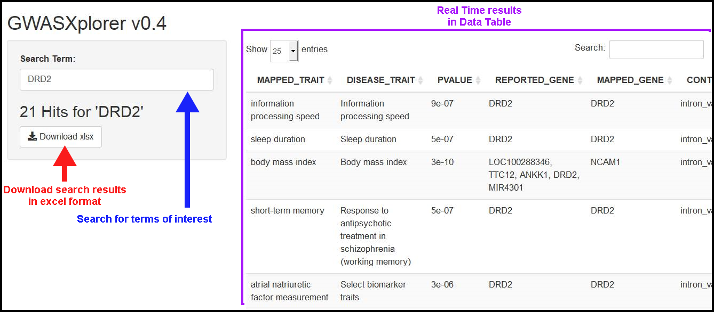

# GWAS Xplorer 
### - A shiny app for sifting through GWAS Catalog data -

## In brief

This app can search, filter and download SNP-trait associations from the GWAS catalog. Search and filter results are shown in real time. We use the most recent version of [GWAS catalog](https://www.ebi.ac.uk/gwas/docs/file-downloads) (All associations v1.0.2) from the EBI site; [column descriptions](https://www.ebi.ac.uk/gwas/docs/fileheaders) for the data reported by GWAS Xplorer are also provided by the EBI site.

An example of the GWAS Xplorer User Interface is shown bellow.

## Version description

- Version 0.4
  * Uses GWAS Catalog release v1.0.2
  * Searches Term of Interest over the gene, disease, and trait columns of GWAS Catalog tsv file
  * Results are displayed in DataTable format
  * Implemented Download button to export results in excel format
  * Fixed bug when and empty Search Term is used

## App configuration

1. [R](https://www.r-project.org/) and [Rstudio](https://www.rstudio.com/) should be properly functional in your computer.

2. The following R packages are required:

- tidyverse
- dplyr
- shiny
- openxlsx

**NOTE**: for convenience, the main app.R script installs required packages automatically.

## How To Run this App

1. Open the app.R script in Rstudio

2. Press "Ctrl" + "Shift" + "Enter" to launch the shiny app

3. Type a term of interest in the "**Search Term**" text box

4. Press the "**Download xlsx**" button to export results

## Author Information

**Project Design**  
Selma Erendira Avendaño Vazquez (seavendano@inmegen.gob.mx)

**Development**  
Israel Aguilar Ordoñez (iaguilar@inmegen.edu.mx)

**Research**  
Víctor Alejandro García Fidencio (alejandro.garfide@ciencias.unam.mx )
